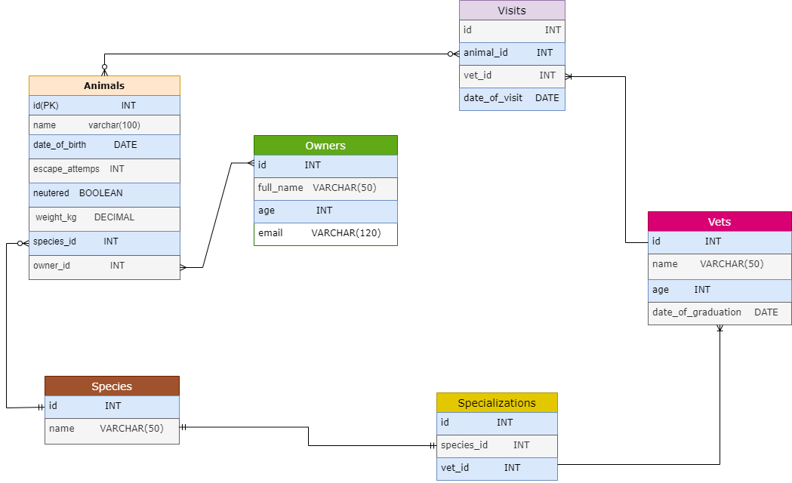

# Vet_Clinic DBMS

> In this project we will use a relational database to create the initial data structure for a vet clinic.
> We will create a table to store animals' information, insert some data into it, and query it.

## Schema Diagram

  
 
## Getting Started

This repository includes files with plain SQL that can be used to recreate a database:

- Use [schema.sql](./schema.sql) to create all tables.
- Use [data.sql](./data.sql) to populate tables with sample data.
- Check [queries.sql](./queries.sql) for examples of queries that can be run on a newly created database. **Important note: this file might include queries that make changes in the database (e.g., remove records). Use them responsibly!**

👤 **Author: **Roland Manful Mweze**

- GitHub: [Rolandm99](https://github.com/RolandM99)
- Twitter: [@Manfulmwez](https://twitter.com/ManfulMwez)
- LinkedIn: [Roland N. MWEZE](https://www.linkedin.com/in/roland-n-mweze-8b1045189/)

## 🤝 Contributing

Contributions, issues, and feature requests are welcome!

Feel free to check the [issues page](../../issues/).

## Show your support

Give a ⭐️ if you like this project!

## Acknowledgments

- Hat tip to anyone whose code was used
- Inspiration
- etc

## 📝 License

This project is [MIT](./MIT.md) licensed.
